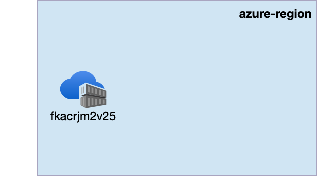
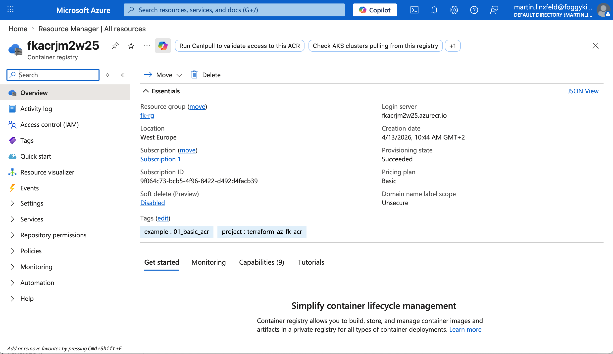

# Example 01: Azure Container Registry (Minimal Baseline)

In this first ACR example, we deploy a **single Azure Container Registry**
using **Terraform / OpenTofu**.

This example introduces the **container registry layer** and is intentionally kept minimal:
no RBAC assignment, no AKS integration, no Private Endpoint, no Private DNS.

Its only purpose is to establish a **clean, correct baseline**
for future Azure Container Registry use cases.

---

## 🧭 Architecture Overview

This deployment creates only the minimum required resources:

- One **Azure Resource Group**
- One **Azure Container Registry**



This example creates:

- One Azure Container Registry
- Configurable ACR SKU
- Public network access enabled
- Admin user disabled by default
- No RBAC assignments
- No Private Endpoints
- No image build or push workflow

This is an **ACR foundation**, not a production-ready container platform.

---

## 🎯 Why this example exists

Before introducing:

- AKS pull integration,
- ACR private access,
- Private DNS,
- RBAC role assignments,
- or CI/CD image publishing,

it is useful to start with the smallest possible registry deployment.

This example focuses on:

- Establishing a correct ACR baseline
- Making service-tier and exposure choices explicit
- Separating registry creation from identity, networking, and consumers

Everything else builds on top of this.

---

## 🚀 Deployment Steps

From the `examples/01_basic_acr` directory:

```bash
cp terraform.tfvars.example terraform.tfvars
tofu init
tofu plan
tofu apply
```

This example uses the published module source from GitHub:
`github.com/mlinxfeld/terraform-az-fk-acr`

---

## 🖼️ Azure Portal View



*Figure 1. Azure Container Registry deployed from the `01_basic_acr` example and visible in Azure Portal.*

---

## 🧹 Cleanup

```bash
tofu destroy
```

---

## 🪪 License

Licensed under the **Universal Permissive License (UPL), Version 1.0**.
