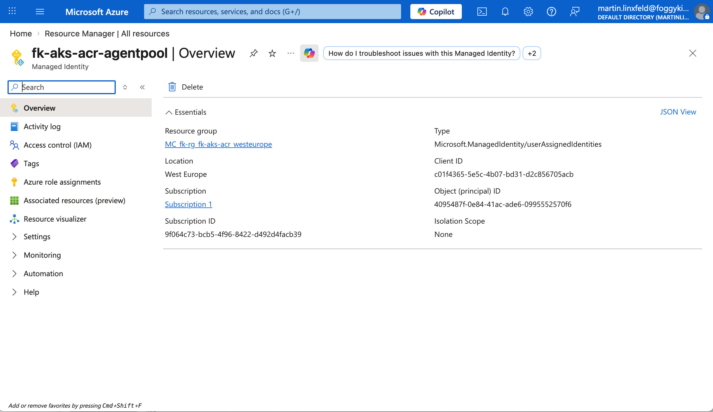

# Example 02: AKS With ACR Attach

In this example, we deploy an **Azure Container Registry** using the
**terraform-az-fk-acr** module and connect it to an
**Azure Kubernetes Service (AKS)** cluster.

This example builds on the ACR baseline from `01_basic_acr` and shows the next
logical step: making the registry usable by a container platform.

It stays intentionally focused:

- ACR is created by this module
- AKS is created by the dedicated `terraform-az-fk-aks` module
- RBAC is created by the dedicated `terraform-az-fk-rbac` module
- AKS kubelet identity receives **AcrPull** on the ACR scope explicitly

This example does **not** build or push images and does **not** deploy any
Kubernetes workload. Its purpose is to demonstrate the infrastructure-side
integration between ACR and AKS.

---

## 🧭 Architecture Overview

This deployment creates:

- One **Azure Resource Group**
- One **Azure Container Registry**
- One **Azure Kubernetes Service** cluster
- One **AcrPull** role assignment created through the RBAC module


The main idea is architectural separation:

- registry lifecycle stays in the ACR module
- cluster lifecycle stays in the AKS module
- authorization lifecycle stays in the RBAC module
- access between them is made explicit through `scope`, `principal_id`, and role name

---

## 🎯 Why this example exists

ACR on its own is only a registry endpoint.
For a real platform scenario, something needs permission to pull images from it.

This example focuses on:

- composing two dedicated modules together
- composing authorization as a third dedicated module
- keeping authorization explicit instead of hidden
- showing the minimal AKS-to-ACR integration path

This is a clean baseline before introducing:

- image build and push workflows
- `kubectl` deployment steps
- public LoadBalancer services
- private ACR networking

---

## 🚀 Deployment Steps

From the `examples/02_aks_with_acr_attach` directory:

```bash
cp terraform.tfvars.example terraform.tfvars
tofu init
tofu plan
tofu apply
```

This example uses published module sources from GitHub:
- `github.com/mlinxfeld/terraform-az-fk-acr`
- `github.com/mlinxfeld/terraform-az-fk-aks`
- `github.com/mlinxfeld/terraform-az-fk-rbac`

After apply, you can verify:

```bash
az acr show -g fk-rg -n <acr-name> --query "{name:name, loginServer:loginServer, sku:sku.name, provisioningState:provisioningState}" -o json
az aks show -g fk-rg -n <cluster-name> --query "{name:name, provisioningState:provisioningState, kubernetesVersion:kubernetesVersion, nodeResourceGroup:nodeResourceGroup}" -o json
az role assignment list --scope <acr-id> --query "[].{role:roleDefinitionName, principalId:principalId}" -o table
```

The expected result is:

- ACR in `Succeeded` state
- AKS in `Succeeded` state
- an **AcrPull** assignment for the AKS kubelet identity on the created ACR

---

## 🖼️ Azure Portal View


*Figure 1. AKS overview showing the cluster in `Succeeded` state and the attached container registry.*


*Figure 2. ACR `Access control (IAM)` showing the explicit `AcrPull` assignment on the registry scope.*



*Figure 3. AKS agent pool managed identity with object ID matching the principal used by the RBAC module.*

---

## 🧹 Cleanup

```bash
tofu destroy
```

---

## 🪪 License

Licensed under the **Universal Permissive License (UPL), Version 1.0**.
