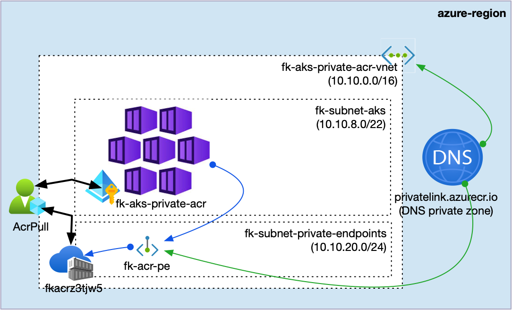
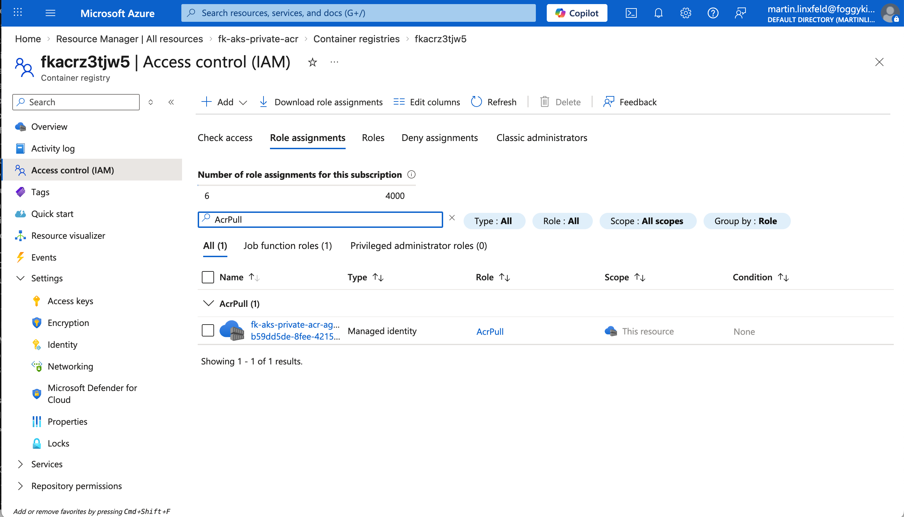
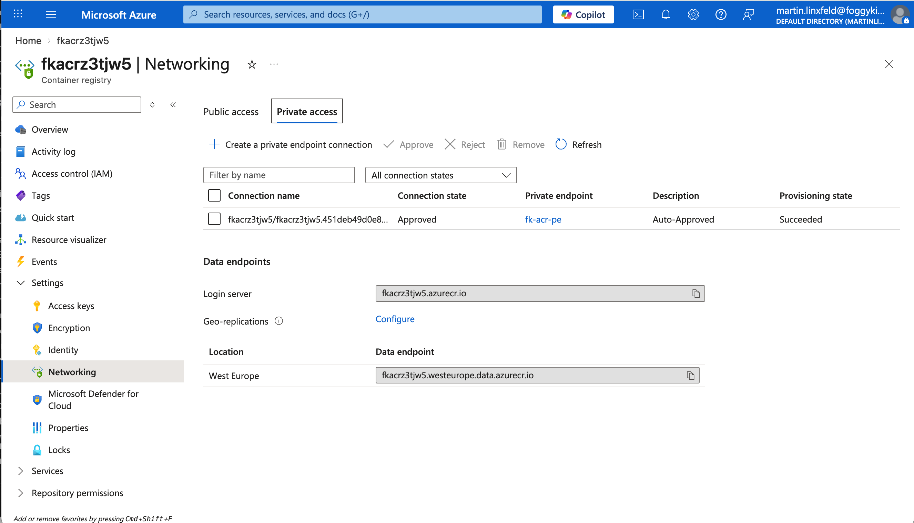
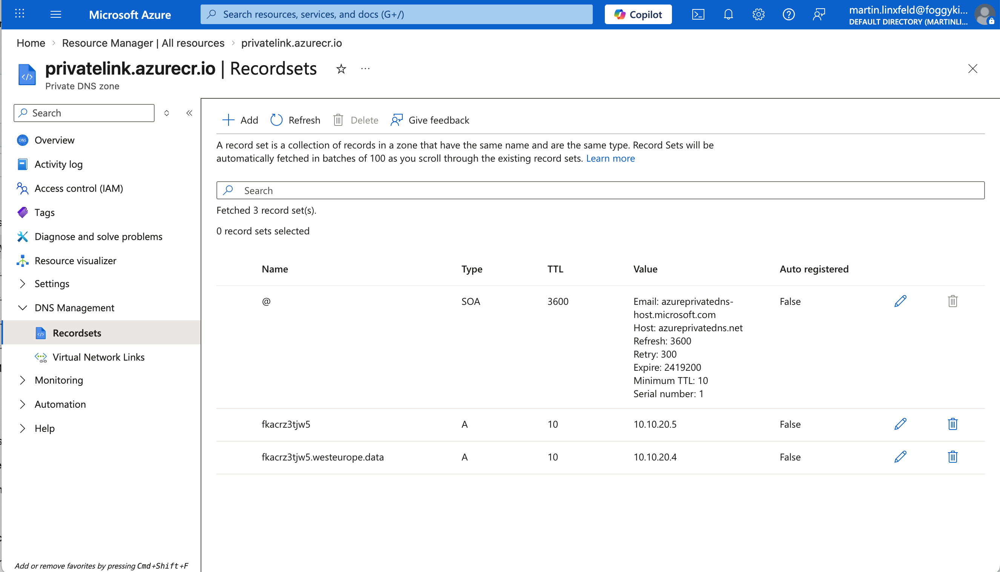
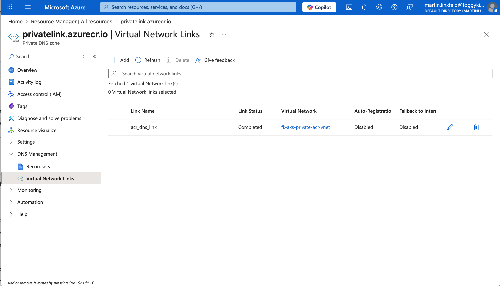
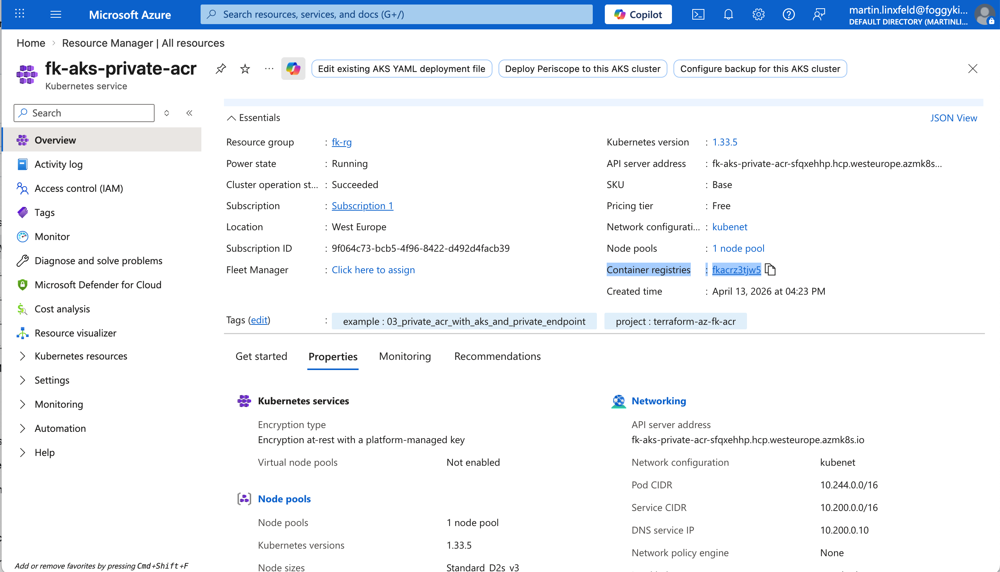

# Example 03: Private ACR With AKS And Private Endpoint

In this example, we deploy an **Azure Container Registry (ACR)** through the
**terraform-az-fk-acr** module and expose it privately to an
**Azure Kubernetes Service (AKS)** cluster using:

- **terraform-az-fk-vnet**
- **terraform-az-fk-private-dns**
- **terraform-az-fk-private-endpoint**
- **terraform-az-fk-rbac**

This example extends `02_aks_with_acr_attach` by moving ACR access from a
public endpoint to a **private endpoint + private DNS** design.

The result is a cleaner production-style pattern:

- ACR stays private
- AKS resolves ACR through Private DNS
- image pull authorization remains explicit through the RBAC module

---

## 🧭 Architecture Overview

This deployment creates:

- One **Azure Resource Group**
- One **Virtual Network** with:
  - one subnet for AKS
  - one subnet for Private Endpoints
- One **Premium Azure Container Registry**
- One **Azure Kubernetes Service** cluster
- One **AcrPull** role assignment created through the RBAC module
- One **Private DNS Zone** for `privatelink.azurecr.io`
- One **Private Endpoint** for the ACR `registry` subresource



The main idea is strict separation of concerns:

- registry lifecycle stays in the ACR module
- cluster lifecycle stays in the AKS module
- authorization lifecycle stays in the RBAC module
- DNS lifecycle stays in the Private DNS module
- private connectivity lifecycle stays in the Private Endpoint module

---

## 🎯 Why this example exists

`02_aks_with_acr_attach` proves the authorization path.
This example adds the **private connectivity path**.

It focuses on:

- private image pull architecture for AKS
- explicit DNS integration for ACR private access
- avoiding public ACR exposure
- keeping registry, compute, RBAC, DNS, and connectivity separate

This is the natural next step before adding actual workloads and end-to-end
container deployment flow.

---

## 🚀 Deployment Steps

From the `examples/03_private_acr_with_aks_and_private_endpoint` directory:

```bash
cp terraform.tfvars.example terraform.tfvars
tofu init
tofu plan
tofu apply
```

This example uses published module sources from GitHub:
- `github.com/mlinxfeld/terraform-az-fk-acr`
- `github.com/mlinxfeld/terraform-az-fk-aks`
- `github.com/mlinxfeld/terraform-az-fk-rbac`
- `github.com/mlinxfeld/terraform-az-fk-vnet`
- `github.com/mlinxfeld/terraform-az-fk-private-dns`
- `github.com/mlinxfeld/terraform-az-fk-private-endpoint`

After apply, you can verify:

```bash
az acr show -g fk-rg -n <acr-name> --query "{name:name, sku:sku.name, publicNetworkAccess:publicNetworkAccess, provisioningState:provisioningState}" -o json
az aks show -g fk-rg -n <cluster-name> --query "{name:name, provisioningState:provisioningState, nodeResourceGroup:nodeResourceGroup}" -o json
az network private-endpoint show -g fk-rg -n fk-acr-pe --query "{name:name, subnet:id, customDnsConfigs:customDnsConfigs}" -o json
az role assignment list --scope <acr-id> --query "[?roleDefinitionName=='AcrPull'].{role:roleDefinitionName, principalId:principalId}" -o table
az network private-dns zone show -g fk-rg -n privatelink.azurecr.io --query "{name:name, maxNumberOfRecordSets:maxNumberOfRecordSets}" -o json
```

The expected result is:

- ACR in `Succeeded` state with `Premium` SKU
- AKS in `Succeeded` state
- a Private Endpoint for ACR
- a Private DNS zone `privatelink.azurecr.io`
- an **AcrPull** assignment for the AKS kubelet identity on the created ACR

---

## 🖼️ Azure Portal View



*Figure 1. ACR `Access control (IAM)` showing the explicit `AcrPull` assignment for the AKS managed identity.*



*Figure 2. ACR networking view showing the approved private endpoint connection.*



*Figure 3. Private DNS zone record sets mapping the ACR hostnames to private IP addresses.*



*Figure 4. Private DNS zone linked to the AKS virtual network.*



*Figure 5. AKS overview showing the cluster in `Succeeded` state and the attached container registry.*

---

## 📤 Outputs

- `acr_id` — Azure Container Registry resource ID
- `acr_name` — Azure Container Registry name
- `acr_login_server` — ACR login server hostname
- `aks_cluster_name` — AKS cluster name
- `aks_kubelet_object_id` — AKS kubelet identity object ID
- `private_endpoint_id` — Private Endpoint resource ID
- `acr_private_endpoint_ip` — private IP address assigned to the ACR Private Endpoint
- `private_dns_zone_id` — Private DNS Zone ID for `privatelink.azurecr.io`

---

## 🧹 Cleanup

```bash
tofu destroy
```

---

## 🪪 License

Licensed under the **Universal Permissive License (UPL), Version 1.0**.
